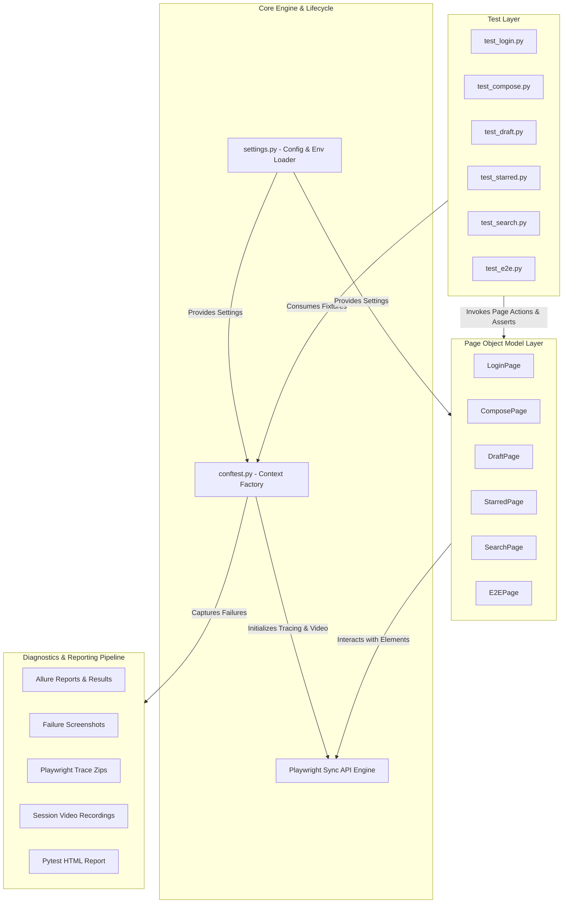
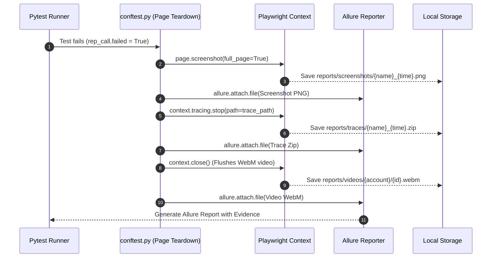

# 🏛️ Architecture Note & Technical Design Decisions

> **Enterprise-Grade Test Automation Framework Architecture for Proton Mail**  
> *Built with Python 3.10+, Playwright (Sync Engine), Pytest, and Allure Reporting*

---

## 📑 Table of Contents
1. [High-Level Architecture](#1-high-level-architecture)
2. [Layered Component Breakdown](#2-layered-component-breakdown)
3. [Key Engineering & Design Decisions](#3-key-engineering--design-decisions)
4. [Failure Diagnostics & Allure Attachment Pipeline](#4-failure-diagnostics--allure-attachment-pipeline)
5. [Resilience & Anti-Flakiness Strategies](#5-resilience--anti-flakiness-strategies)
6. [Multi-Account Test Lifecycle](#6-multi-account-test-lifecycle)
7. [Directory & Artifact Topology](#7-directory--artifact-topology)

---

## 1. High-Level Architecture

The framework is architected on a **Modular Page Object Model (POM)** layered cleanly between the test specifications, business logic abstractions, browser context managers, and failure diagnostics.



---

## 2. Layered Component Breakdown

### 2.1 Test Layer (`tests/`)
- Contains test functions grouped in test classes decorated with Pytest markers (`@pytest.mark.sanity`, `@pytest.mark.regression`, `@pytest.mark.auth`, etc.) and Allure metadata (`@allure.feature()`, `@allure.severity()`).
- Encapsulates pure test assertions (`assert`, `expect()`) without hardcoded DOM locators.

### 2.2 Page Object Layer (`pages/`)
- Encapsulates DOM locators as uppercase class constants (`LOC_...`) and user actions as semantic methods (`open_composer()`, `login()`, `search_for()`).
- Contains zero test assertions to maintain reusability across positive, negative, and E2E scenarios.

### 2.3 Configuration & Settings Layer (`config/settings.py`)
- Single source of truth loaded dynamically via `python-dotenv`.
- Normalizes usernames and email formats automatically.
- Sets standardized explicit timeouts (`DEFAULT_TIMEOUT=30s`, `NAV_TIMEOUT=60s`).

### 2.4 Fixtures & Lifecycle Layer (`conftest.py`)
- Session-scoped `browser` fixture launches Chromium with anti-bot evasion flags.
- Function-scoped `page` fixture instantiates an isolated `BrowserContext` with tracing and video recording enabled.
- Automatic teardown inspects test outcome (`rep_call.failed`) to trigger failure artifact capture.

---

## 3. Key Engineering & Design Decisions

### 3.1 Synchronous Playwright API vs. Asynchronous API
- **Decision:** Selected **Playwright Sync API** (`playwright.sync_api`).
- **Rationale:** Pytest runs tests sequentially per worker. The synchronous API eliminates unnecessary `async/await` overhead across test files and page objects, creating cleaner, more readable test code that is simpler to maintain and debug.

### 3.2 Dynamic Context Creation with Auto-Tracing
- **Decision:** Each test receives a freshly created `BrowserContext` with `context.tracing.start(screenshots=True, snapshots=True, sources=True)`.
- **Rationale:** Guarantees absolute test isolation without state bleeding, cache poisoning, or cookie contamination between tests.

### 3.3 Storage Management for Traces & Videos
- **Decision:** Traces and video files are only persisted for **failed tests**; passed tests discard traces and clean up videos automatically.
- **Rationale:** Prevents multi-gigabyte disk consumption during large-scale CI runs while preserving rich diagnostic evidence when defects occur.

---

## 4. Failure Diagnostics & Allure Attachment Pipeline

When a test failure is detected via `pytest_runtest_makereport`, the framework triggers an automated capture sequence:



---

## 5. Resilience & Anti-Flakiness Strategies

### 5.1 Sandboxed Rooster Iframe Editor Handling
Proton Mail renders its message body inside an isolated `<iframe>` (`rooster-editor`):
```python
# ComposePage.enter_body()
try:
    editor_frame = self.page.frame_locator("//iframe[contains(@class,'rooster') or contains(@title,'composer') or contains(@title,'editor')]")
    editor = editor_frame.locator("div[contenteditable='true'], [role='textbox']")
    editor.first.wait_for(state="visible", timeout=DEFAULT_TIMEOUT)
    editor.first.click()
    editor.first.type(body)
except Exception:
    # Resilient Fallback: Tab navigation directly into editor body
    self.subject_input.click()
    self.subject_input.press("Tab")
    self.page.wait_for_timeout(400)
    self.page.keyboard.type(body)
```
- **Primary Method:** Targets iframe through Playwright's `frame_locator` API.
- **Fallback Method:** If iframe initialization is delayed by network lag, standard keyboard `Tab` navigation transfers focus into the editor body without failing the test.

### 5.2 Anti-Bot & Automation Detection Evasion
Proton Mail enforces client-side anti-automation checks. The framework applies dedicated Chromium arguments in `LAUNCH_OPTIONS`:
```python
LAUNCH_OPTIONS = {
    "headless": HEADLESS,
    "slow_mo": SLOW_MO,
    "args": [
        "--disable-blink-features=AutomationControlled",  # Strips navigator.webdriver flags
        "--no-sandbox",                                    # Required in Linux CI environments
        "--disable-dev-shm-usage",
    ]
}
```

### 5.3 Dynamic Search Bar Expansion
The search bar requires a focus interaction to expand its input container:
- `SearchPage.enter_search_text()` executes an explicit `click()` on the collapsed placeholder.
- Waits for the expanded input locator (`LOC_FILL_SEARCH`) to become visible before typing.

### 5.4 File Preview Modal Dismissal
Opening an attachment triggers a full-page preview overlay (`file-preview`) that blocks header navigation:
- `E2EPage.close_preview_if_open()` presses `Escape` and waits for overlay detachment prior to executing user logout.

---

## 6. Multi-Account Test Lifecycle

For end-to-end tests involving cross-account communication (`test_e2e.py`):
1. **Sender Session:** Sender authenticates, dispatches timestamped email / attachment, and executes a clean logout via `LoginPage.logout_user()`.
2. **Session Cleanup:** Browser waits for session cookies to invalidate and redirects cleanly to `https://account.proton.me`.
3. **Receiver Session:** Receiver logs in within the same browser instance, verifies receipt of email/attachment in inbox, and performs clean logout.

---

## 7. Directory & Artifact Topology

```
Turium AI/
├── config/
│   └── settings.py            # Central Configuration & Environment Manager
├── docs/                      # Comprehensive Technical Documentation
│   ├── ARCHITECTURE_NOTE.md   # Architecture & Technical Design Note
│   ├── DEFECT_REPORT.md       # Defect Catalog & Edge Cases
│   ├── TEST_CASES.md          # Complete Test Matrix & Suite Specifications
│   └── TEST_REPORT.md         # Test Execution Metrics & Summary
├── pages/                     # Page Object Model Layer
│   ├── compose_page.py        # Composer & iframe editor handler
│   ├── draft_page.py          # Draft folder & auto-save actions
│   ├── e2e_page.py            # End-to-End workflow aggregators
│   ├── login_page.py          # Authentication & session controls
│   ├── search_page.py         # Search bar, query clear, & filter actions
│   └── starred_page.py        # Starring & Starred folder validation
├── reports/                   # Automated Diagnostics & Execution Artifacts
│   ├── allure-results/        # Raw Allure execution data & JSONs
│   ├── allure-report/         # Standalone Allure HTML dashboard
│   ├── screenshots/           # Full-page failure PNG screenshots
│   ├── traces/                # Playwright trace zip archives
│   ├── videos/                # Test session WebM recordings
│   └── report.html            # Standalone Pytest HTML report
├── tests/                     # Test Suites & Fixtures
│   ├── conftest.py            # Shared fixtures & test hooks
│   ├── test_compose.py        # Compose suite
│   ├── test_draft.py          # Drafts suite
│   ├── test_e2e.py            # Multi-account E2E suite
│   ├── test_login.py          # Authentication suite
│   ├── test_search.py         # Search & filter suite
│   └── test_starred.py        # Starred messages suite
├── conftest.py                # Root fixture & Allure failure attachment hook
├── pytest.ini                 # Pytest runner configuration & marker taxonomy
└── requirements.txt           # Python dependency specifications
```

