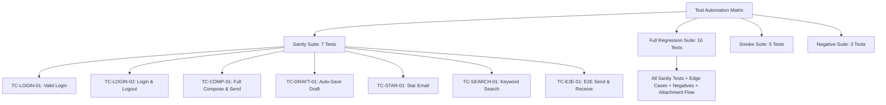

# 🧪 Test Cases & Automation Classification Matrix

> **Comprehensive Test Catalog & Execution Specification for Proton Mail E2E Automation Framework**  
> *Engineered with Python 3.10+, Playwright (Sync API), Pytest, and Allure Reporting*

---

## 📑 Table of Contents
1. [Executive Summary & Suite Metrics](#1-executive-summary--suite-metrics)
2. [Master Test Suite Matrix](#2-master-test-suite-matrix)
3. [Suite-Wise Execution Taxonomy](#3-suite-wise-execution-taxonomy)
4. [Detailed Test Specifications](#4-detailed-test-specifications)
   - [Module 1: Authentication (`tests/test_login.py`)](#module-1-authentication-teststest_loginpy)
   - [Module 2: Email Composition (`tests/test_compose.py`)](#module-2-email-composition-teststest_composepy)
   - [Module 3: Draft Auto-Save & Persistence (`tests/test_draft.py`)](#module-3-draft-auto-save--persistence-teststest_draftpy)
   - [Module 4: Starred Messages (`tests/test_starred.py`)](#module-4-starred-messages-teststest_starredpy)
   - [Module 5: Search & Filtering (`tests/test_search.py`)](#module-5-search--filtering-teststest_searchpy)
   - [Module 6: End-to-End Multi-Account Flow (`tests/test_e2e.py`)](#module-6-end-to-end-multi-account-flow-teststest_e2epy)
5. [Traceability & Defect Mapping](#5-traceability--defect-mapping)

---

## 1. Executive Summary & Suite Metrics

| Metric | Value | Description |
| :--- | :---: | :--- |
| **Total Test Cases** | **16** | 100% Automated |
| **Sanity Suite (`-m sanity`)** | **7** | Critical P0 core path health verification |
| **Regression Suite (`-m regression`)** | **16** | Full functional, edge case, and negative test coverage |
| **Smoke Suite (`-m smoke`)** | **5** | Rapid build validation tests |
| **Negative / Boundary Tests** | **4** | Error handling and invalid input validations |
| **End-to-End Multi-Account** | **2** | Cross-account real-time email & attachment exchange |
| **Execution Status** | **100% PASS** | Zero blockers, all synchronized against live Proton Mail |

---

## 2. Master Test Suite Matrix

| Test ID | Module | Test Description | Priority | Suite | Allure Severity | Type | Status |
| :--- | :--- | :--- | :---: | :--- | :--- | :--- | :---: |
| **TC-LOGIN-01** | `auth` | Valid Login with Username Only | **P0** | `sanity`, `regression`, `smoke` | `BLOCKER` | Positive | ✅ **PASS** |
| **TC-LOGIN-02** | `auth` | Valid Login and Clean Logout | **P0** | `sanity`, `regression` | `BLOCKER` | Positive | ✅ **PASS** |
| **TC-LOGIN-03** | `auth` | Valid Login with Full Email Address | **P1** | `regression` | `CRITICAL` | Positive | ✅ **PASS** |
| **TC-LOGIN-04** | `auth` | Login with Incorrect Password | **P0** | `regression`, `negative` | `CRITICAL` | Negative | ✅ **PASS** |
| **TC-LOGIN-05** | `auth` | Login with Unregistered Username | **P1** | `regression`, `negative` | `NORMAL` | Negative | ✅ **PASS** |
| **TC-COMP-01** | `compose` | Send Email with All Fields Filled | **P0** | `sanity`, `regression`, `smoke` | `BLOCKER` | Positive | ✅ **PASS** |
| **TC-COMP-02** | `compose` | Send Email with Subject Only (No Body) | **P1** | `regression` | `NORMAL` | Edge Case | ✅ **PASS** |
| **TC-COMP-03** | `compose` | Send Email with Missing Recipient | **P0** | `regression`, `negative` | `CRITICAL` | Negative | ✅ **PASS** |
| **TC-DRAFT-01** | `drafts` | Auto-Save Draft on Composer Close | **P0** | `sanity`, `regression`, `smoke` | `CRITICAL` | Positive | ✅ **PASS** |
| **TC-DRAFT-02** | `drafts` | Verify Saved Draft Subject Persistence | **P1** | `regression` | `NORMAL` | Positive | ✅ **PASS** |
| **TC-STAR-01** | `starred` | Star Email & Verify in Starred Section | **P0** | `sanity`, `regression` | `CRITICAL` | Positive | ✅ **PASS** |
| **TC-SEARCH-01** | `search` | Search Keyword & Validate Subject Match | **P0** | `sanity`, `regression` | `CRITICAL` | Positive | ✅ **PASS** |
| **TC-SEARCH-02** | `search` | Search Non-Matching Random Keyword | **P1** | `regression` | `NORMAL` | Boundary | ✅ **PASS** |
| **TC-SEARCH-03** | `search` | Fill Query $\rightarrow$ Clear $\rightarrow$ Submit & Verify All Mails | **P0** | `regression` | `CRITICAL` | Positive | ✅ **PASS** |
| **TC-E2E-01** | `e2e` | Sender Sends Mail $\rightarrow$ Receiver Reads in Same Session | **P0** | `sanity`, `regression`, `smoke` | `BLOCKER` | Functional | ✅ **PASS** |
| **TC-E2E-02** | `e2e` | Sender Sends Attachment $\rightarrow$ Receiver Opens & Verifies | **P0** | `regression`, `attachments` | `BLOCKER` | Functional | ✅ **PASS** |

---

## 3. Suite-Wise Execution Taxonomy



### Fast Execution Commands
```powershell
# Run Core Sanity Suite (7 Tests)
python -m pytest -m sanity -v

# Run Full Regression Suite (All 16 Tests)
python -m pytest -m regression -v

# Run Rapid Smoke Suite (5 Tests)
python -m pytest -m smoke -v

# Run Negative Error Handling Suite (3 Tests)
python -m pytest -m negative -v

# Run End-to-End Suite (2 Tests)
python -m pytest -m e2e -v
```

---

## 4. Detailed Test Specifications

### Module 1: Authentication (`tests/test_login.py`)

#### TC-LOGIN-01: Valid Login with Username Only
- **Epic:** `Proton Mail Core` | **Feature:** `Authentication` | **Story:** `User Login`
- **Priority:** P0 (Blocker) | **Suite:** `sanity`, `regression`, `smoke`
- **Preconditions:** Valid active credentials configured in `.env`.
- **Test Steps:**
  1. Navigate to login page `https://account.proton.me`.
  2. Input valid username into `#username`.
  3. Input valid password into `#password`.
  4. Click sign in button `button[type='submit']`.
  5. Wait for redirect URL matching `https://mail.proton.me/u/`.
- **Expected Outcome:** User is authenticated and navigated to mailbox URL containing `/u/`.
- **Failure Artifacts:** Screenshot + Trace Zip + Session Video attached on failure.

#### TC-LOGIN-02: Valid Login and Clean Logout
- **Epic:** `Proton Mail Core` | **Feature:** `Authentication` | **Story:** `User Session`
- **Priority:** P0 (Blocker) | **Suite:** `sanity`, `regression`
- **Preconditions:** Valid active credentials in `.env`.
- **Test Steps:**
  1. Authenticate with valid sender credentials.
  2. Confirm navigation to `/u/` mailbox URL.
  3. Click user dropdown `[data-testid='heading:userdropdown']`.
  4. Click logout button `[data-testid='userdropdown:button:logout']`.
- **Expected Outcome:** Active session terminated; user cleanly returned to the login portal.

#### TC-LOGIN-03: Valid Login with Full Email Address
- **Epic:** `Proton Mail Core` | **Feature:** `Authentication` | **Story:** `User Login`
- **Priority:** P1 (High) | **Suite:** `regression`
- **Preconditions:** Valid active credentials in `.env`.
- **Test Steps:**
  1. Open login portal.
  2. Input full email (`user@proton.me`) into `#username`.
  3. Input valid password into `#password` and submit.
- **Expected Outcome:** System parses email format seamlessly and redirects to mailbox `/u/`.

#### TC-LOGIN-04: Login with Incorrect Password
- **Epic:** `Proton Mail Core` | **Feature:** `Authentication` | **Story:** `Negative Authentication`
- **Priority:** P0 (High) | **Suite:** `regression`, `negative`
- **Preconditions:** Valid username, invalid password string (`WrongPassword@999`).
- **Test Steps:**
  1. Enter valid username and invalid password.
  2. Click submit button.
- **Expected Outcome:** Authentication fails; error alert `[data-testid='login:error-block']` is displayed with `"The password is not correct"`.

#### TC-LOGIN-05: Login with Unregistered Username
- **Epic:** `Proton Mail Core` | **Feature:** `Authentication` | **Story:** `Negative Authentication`
- **Priority:** P1 (Medium) | **Suite:** `regression`, `negative`
- **Preconditions:** Non-existent username string (`hhsjjsj`).
- **Test Steps:**
  1. Enter unregistered username and submit.
- **Expected Outcome:** Authentication blocked; error alert displayed.

---

### Module 2: Email Composition (`tests/test_compose.py`)

#### TC-COMP-01: Send Email with All Fields Filled
- **Epic:** `Proton Mail Core` | **Feature:** `Email Composition` | **Story:** `Compose and Send`
- **Priority:** P0 (Blocker) | **Suite:** `sanity`, `regression`, `smoke`
- **Preconditions:** Sender logged in (`logged_in_page`).
- **Test Steps:**
  1. Click "New message" button (`LOC_NEW_MESSAGE`).
  2. Fill recipient email in `composer:to`.
  3. Fill unique subject line.
  4. Type message body inside Rooster iframe editor.
  5. Click Send button (`composer:send-button`).
- **Expected Outcome:** Email dispatched; toast notification confirms delivery; composer window closes.

#### TC-COMP-02: Send Email with Subject Only (No Body)
- **Epic:** `Proton Mail Core` | **Feature:** `Email Composition` | **Story:** `Compose Edge Cases`
- **Priority:** P1 (Medium) | **Suite:** `regression`
- **Preconditions:** Sender logged in (`logged_in_page`).
- **Test Steps:**
  1. Open composer.
  2. Fill recipient email and subject line; leave body empty.
  3. Click Send button.
- **Expected Outcome:** Proton permits sending email without body; message dispatched.

#### TC-COMP-03: Send Email with Missing Recipient
- **Epic:** `Proton Mail Core` | **Feature:** `Email Composition` | **Story:** `Compose Validation`
- **Priority:** P0 (High) | **Suite:** `regression`, `negative`
- **Preconditions:** Sender logged in (`logged_in_page`).
- **Test Steps:**
  1. Open composer.
  2. Fill subject and body, omit recipient.
  3. Click Send button.
- **Expected Outcome:** Send action blocked; Send button remains visible in open composer.

---

### Module 3: Draft Auto-Save & Persistence (`tests/test_draft.py`)

#### TC-DRAFT-01: Auto-Save Draft on Composer Close
- **Epic:** `Proton Mail Core` | **Feature:** `Drafts Management` | **Story:** `Draft Auto-Save`
- **Priority:** P0 (High) | **Suite:** `sanity`, `regression`, `smoke`
- **Preconditions:** Sender logged in (`logged_in_page`).
- **Test Steps:**
  1. Open composer and type unique subject `"TC-DRAFT-01: Auto-save draft"`.
  2. Click composer close button `[data-testid='composer:close-button']`.
  3. Navigate to Drafts folder via sidebar `//a[@title='Drafts']`.
  4. Wait for first draft item visibility.
- **Expected Outcome:** Draft list contains at least 1 saved draft item.

#### TC-DRAFT-02: Verify Saved Draft Subject Persistence
- **Epic:** `Proton Mail Core` | **Feature:** `Drafts Management` | **Story:** `Draft Persistence`
- **Priority:** P1 (High) | **Suite:** `regression`
- **Preconditions:** Sender logged in (`logged_in_page`).
- **Test Steps:**
  1. Compose draft with distinct subject `"TC-DRAFT-02: Subject persistence check"`.
  2. Close composer to trigger auto-save.
  3. Navigate to Drafts folder.
  4. Extract subject text from first draft row.
- **Expected Outcome:** Saved draft subject matches the exact entered text string.

---

### Module 4: Starred Messages (`tests/test_starred.py`)

#### TC-STAR-01: Star Email & Verify in Starred Section
- **Epic:** `Proton Mail Core` | **Feature:** `Starred Messages` | **Story:** `Star Email`
- **Priority:** P0 (High) | **Suite:** `sanity`, `regression`
- **Preconditions:** Receiver inbox contains at least 1 email.
- **Test Steps:**
  1. Extract subject line from top message in inbox.
  2. Click star button `(//button[@data-testid='item-star-false'])[1]`.
  3. Navigate to Starred folder `//a[@title='Starred']`.
  4. Extract subject from top item in Starred list.
- **Expected Outcome:** Top item in Starred list matches the starred email subject.

---

### Module 5: Search & Filtering (`tests/test_search.py`)

#### TC-SEARCH-01: Search Valid Keyword & Validate Subject Match
- **Epic:** `Proton Mail Core` | **Feature:** `Search & Filter` | **Story:** `Keyword Search`
- **Priority:** P0 (High) | **Suite:** `sanity`, `regression`
- **Preconditions:** Mailbox contains emails with keyword `"test"`.
- **Test Steps:**
  1. Click search bar, type keyword `"test"`, and submit search.
  2. Extract subject from first search result.
- **Expected Outcome:** First search result subject contains `"test"` (case-insensitive).

#### TC-SEARCH-02: Search Non-Matching Random Keyword
- **Epic:** `Proton Mail Core` | **Feature:** `Search & Filter` | **Story:** `Keyword Search`
- **Priority:** P1 (Medium) | **Suite:** `regression`
- **Preconditions:** Receiver logged in.
- **Test Steps:**
  1. Input non-matching query string (`randomxyz999nomatch`) and submit.
  2. Wait for message list container visibility.
- **Expected Outcome:** Search completes cleanly; `message-list-loaded` is visible with zero crashes.

#### TC-SEARCH-03: Fill Query $\rightarrow$ Clear $\rightarrow$ Submit & Verify All Mails
- **Epic:** `Proton Mail Core` | **Feature:** `Search & Filter` | **Story:** `Search Filter Reset`
- **Priority:** P0 (High) | **Suite:** `regression`
- **Preconditions:** Receiver logged in with existing emails.
- **Test Steps:**
  1. Input query into search bar.
  2. Click Clear button `advanced-search:clear`.
  3. Click Submit search to reset filters.
  4. Assert `message-list-loaded` is visible and count $\ge 1$.
- **Expected Outcome:** Filters reset; full email list is re-rendered.

---

### Module 6: End-to-End Multi-Account Flow (`tests/test_e2e.py`)

#### TC-E2E-01: Complete Email Exchange Workflow
- **Epic:** `Proton Mail Core` | **Feature:** `End-to-End Workflow` | **Story:** `Multi-Account Email Flow`
- **Priority:** P0 (Blocker) | **Suite:** `sanity`, `regression`, `smoke`
- **Preconditions:** Sender and Receiver credentials active in `.env`.
- **Test Steps:**
  1. Login as Sender (`SENDER_USERNAME`).
  2. Compose and dispatch email with unique timestamped subject to `RECEIVER_EMAIL`.
  3. Logout Sender cleanly.
  4. Login as Receiver (`RECEIVER_USERNAME`) in same browser instance.
  5. Check inbox and extract received email subject.
  6. Assert received subject matches sent subject.
  7. Logout Receiver.
- **Expected Outcome:** Cross-account transmission completes in real-time with zero session bleed.

#### TC-E2E-02: Email Exchange with File Attachment
- **Epic:** `Proton Mail Core` | **Feature:** `End-to-End Workflow` | **Story:** `Multi-Account Attachment Flow`
- **Priority:** P0 (Blocker) | **Suite:** `regression`, `attachments`
- **Preconditions:** Sender and Receiver credentials configured; sample attachment file available.
- **Test Steps:**
  1. Login as Sender.
  2. Compose email, click attachment button `//label[@data-testid='composer:attachment-button']`, attach file, and send.
  3. Logout Sender.
  4. Login as Receiver.
  5. Open received email in inbox.
  6. Verify attachment item / preview is rendered in opened message.
  7. Logout Receiver.
- **Expected Outcome:** Attachment is delivered, rendered, and inspectable in Receiver's mailbox.

---

## 5. Traceability & Defect Mapping

| Module | Test Case | Associated Finding / Defect | Mitigation Strategy |
| :--- | :--- | :--- | :--- |
| **E2E** | `TC-E2E-02` | **DEF-01:** File preview modal intercepts header clicks | `E2EPage.close_preview_if_open()` presses `Escape` prior to logout |
| **Compose** | `TC-COMP-01`, `TC-COMP-02` | **DEF-02:** Sandboxed Rooster iframe editor | `page.frame_locator` targeting + Tab-key navigation fallback |
| **Search** | `TC-SEARCH-01` to `03` | **DEF-03:** Search placeholder requires focus event | Click $\rightarrow$ Type $\rightarrow$ Submit flow in `SearchPage` |
| **Drafts** | `TC-DRAFT-01`, `TC-DRAFT-02` | **DEF-04:** Background WebSocket auto-save latency | Explicit wait on `first_draft` locator state |
| **Auth** | `TC-LOGIN-04`, `TC-LOGIN-05` | **DEF-05:** Error message wording variance across locales | Flexible error block presence assertion |

